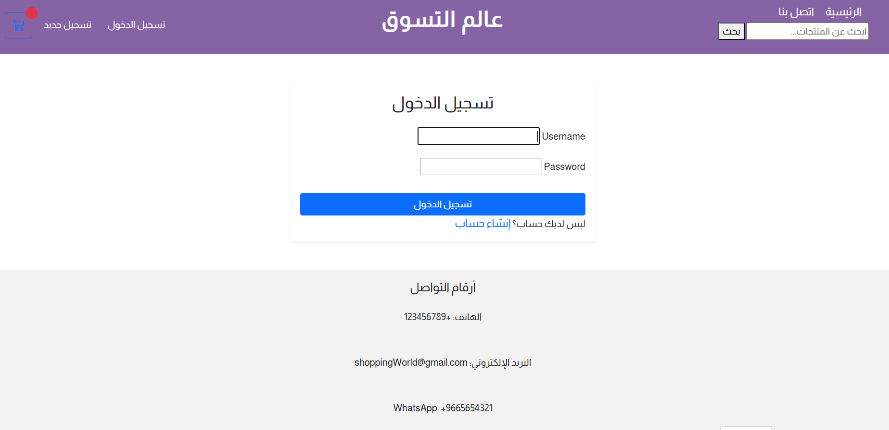
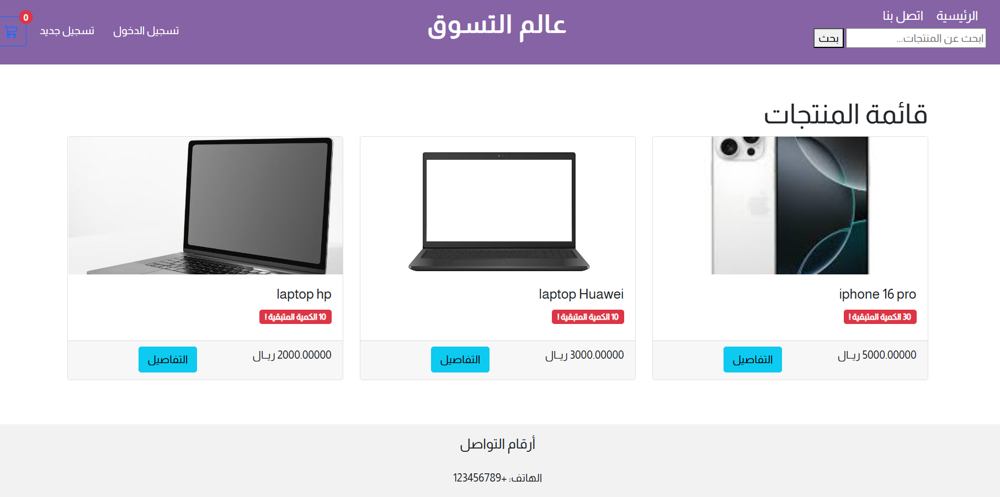

# مشروع التجارة الإلكترونية - E-commerce Project

  # عالم التسوق

## نظرة عامة
هذا المشروع هو منصة تجارة إلكترونية تم تطويرها باستخدام **Django** و **Python** لبيع المنتجات عبر الإنترنت. يوفر المشروع واجهة سهلة الاستخدام لتصفح المنتجات، إضافة المنتجات إلى السلة، وإتمام عملية الدفع.

## التقنيات المستخدمة
- **Django**: إطار العمل الأساسي لبناء التطبيقات.
- **MySQL**: قاعدة البيانات لتخزين بيانات المستخدمين والمنتجات.
- **Bootstrap**: لتصميم واجهات المستخدم بشكل استجابة وسريع.
- **JavaScript**: لتحسين التفاعل والتفاعل مع الصفحة.

## أقسام المشروع

## الصفحة الرئيسية
صورة لواجهة الصفحة الرئيسية للموقع:

## الميزات الرئيسية
- تصفح الفئات المختلفة للمنتجات (مثل: الإلكترونيات، الأثاث، أدوات المطبخ).
- إمكانية عرض المنتجات مع تفاصيلها.
- إضافة المنتجات إلى السلة وإتمام عملية الدفع باستخدام بوابة الدفع الإلكتروني.
- إدارة بيانات المستخدمين وعمليات الدفع.

### 1. قسم الحسابات
يسمح للمستخدمين بالتسجيل وتسجيل الدخول لإدارة حساباتهم، حيث يمكنهم تتبع الطلبات وإجراء التعديلات على تفاصيل الحساب مثل الاسم، البريد الإلكتروني، وتغيير كلمة المرور.

### عرض المنتجات
تم تصميم صفحة عرض المنتجات بحيث تحتوي على قائمة من المنتجات مع معلومات عنها، مثل الاسم والسعر والكمية المتبقية. يُمكن للمستخدمين استعراض المنتجات ومتابعة الشراء.

### * صفحة التفاصيل
هذا القسم يعرض تفاصيل اكثر حول كل منتج. يتضمن المعلومات التالية:
- **اسم المنتج**
- **الوصف**
- **السعر**
- **الصور**

)

### صفحة الدفع
يتيح للمستخدمين إتمام عملية الدفع عبر الإنترنت باستخدام معلومات البطاقة الائتمانية.

